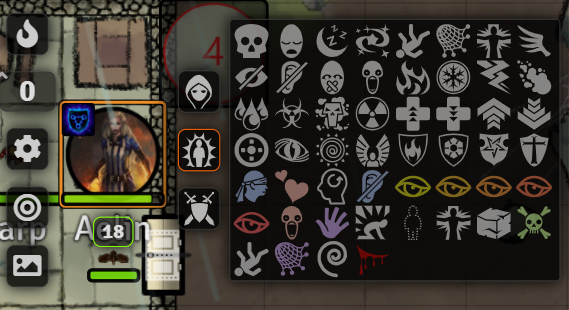
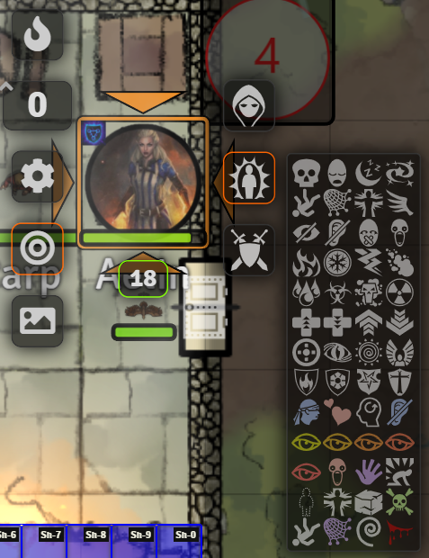

# jalen-token-hud-tweaks 

Discord: jalensailin#1177

What this module does (read the rest for more details): 
  1. It makes status icons appear larger on the token 
  2. It changes the layout of the status effects list to be horizontal instead of vertical, and centers this list around the token.
  3. It increases the opacity behind the HUD and status icons (this was not my change but I left it there because I liked it). 

Acknowledgements: Forked from Illandril's Token HUD Scaler. https://github.com/illandril/FoundryVTT-token-hud-scale. The init.js file came directly from Illandril's mod. Also takes some CSS written by Sky. Thank you to both of them, the creators of Foundry, and all the other module/system/art developers. Y'all are amazing. 

Description from Illandril's Mod: "Improves the visibility of the Status Effect icons. Adjusts the size of token status effects so they fit 3 across for the token (60% larger than standard for 1:1 tokens, much larger than standard for double-sized tokens, slightly smaller than standard for half-size tokens), and increases the opacity of the background behind both the Token HUD and Status Effect icons."

My changes: I liked how Illandril made the status icons appear larger on the token, but I didn't like the scaling of the entire HUD. I commented out the lines which scaled the HUD and left the lines which changed the size of the status icons, with some slight tweaks. I also don't like how the core version had the status effects list oriented vertically. So, the status Effect List is now horizontal (8 columns total), inspired by Sky's CSS change.

Example:

  With my changes:
  
  
  
  Original:
  
  

Compatibility: I literally know very little about coding, so I am not sure how this would be compatible with other mods. I imagine mods which change the CSS of the token HUD will not be compatible but who knows. I also don't know if this is system agnostic. I use it for DnD 5e. Hopefully someone can clear the air on this stuff. 

Installation (easy):
  1. Copy and paste the following link into the Foundry Add-on Modules tab in the configuration and setup page: https://raw.githubusercontent.com/jalensailin/jalen-token-hud-tweaks/main/module.json
  2. Enable it in your module settings in your world.

Installation (manual): 
  1. Download all files.
  2. Right click and Copy jalen-token-hud-tweaks folder.
  3. Navigate to your modules folder in the Foundry user data 
      -Right click on Foundry app, lick Browse User Data.
      -Click into Data folder
      -Click into modules folder
  4. Paste jalen-token-hud-tweaks folder into modules folder. 
  5. In your Foundry world, navigate to the Manage Modules page and enable Jalen's Token HUD Tweaks
 
Customize: 
If you want to customize this module (or the original one) to suit your needs better, hit me up on Discord jalensailin#1177 and I'll try my best to walk you through what I did. 
